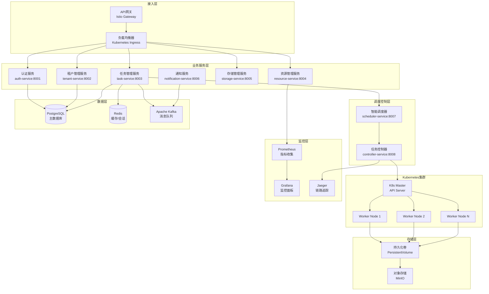
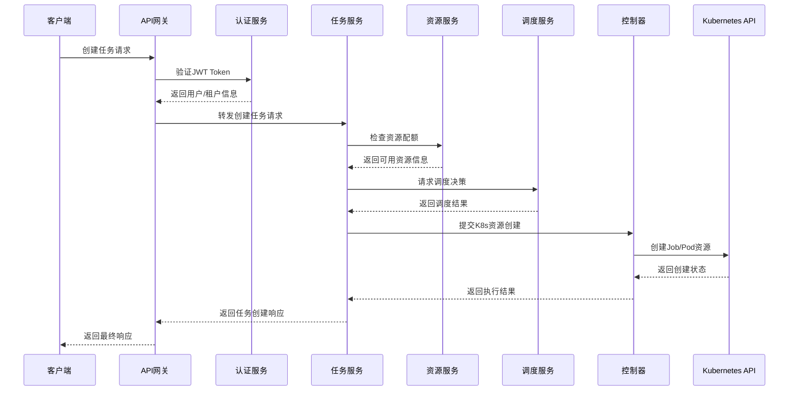
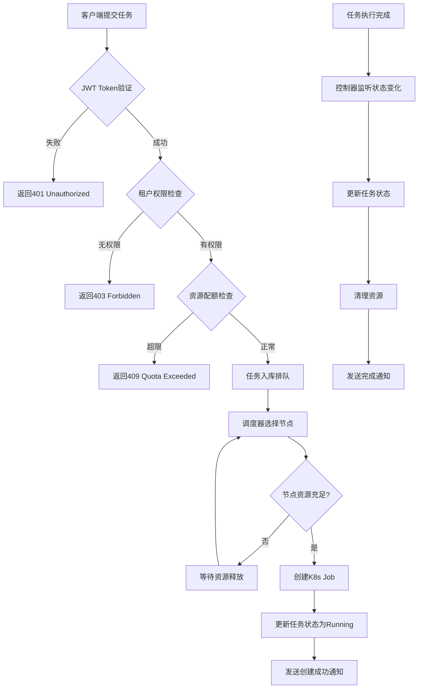

# 基于Kubernetes的多租户算力平台技术文档

## 目录
1. [系统概述](#1-系统概述)
2. [系统架构设计](#2-系统架构设计)
3. [核心组件设计](#3-核心组件设计)
4. [技术实现方案](#4-技术实现方案)
5. [安全设计](#5-安全设计)
6. [监控告警](#6-监控告警)
7. [部署指南](#7-部署指南)
8. [运维管理](#8-运维管理)

## 1. 系统概述

### 1.1 项目简介
基于Kubernetes构建的企业级多租户算力平台，为用户提供容器化计算资源的统一管理、调度和监控能力。平台支持多种计算任务类型，包括批处理、流计算、机器学习训练等场景。

### 1.2 核心功能
- **多租户管理**: 完整的租户隔离、资源配额管理
- **容器生命周期管理**: 创建、启动、停止、删除容器任务
- **存储管理**: 持久化卷挂载、数据持久化
- **资源调度**: 智能调度算法、资源优化分配
- **监控告警**: 实时监控、自动告警、性能分析
- **用户管理**: RBAC权限控制、多级用户体系

### 1.3 技术栈选型
- **后端语言**: Go 1.21+
- **容器编排**: Kubernetes 1.27+
- **HTTP框架**: Gin
- **数据库**: PostgreSQL 15+ + Redis 7+
- **消息队列**: Apache Kafka 3.0+
- **监控**: Prometheus + Grafana + Jaeger
- **存储**: MinIO / Ceph RBD
- **服务网格**: Istio

## 2. 系统架构设计

### 2.1 整体架构图



### 2.2 微服务拆分

#### 2.2.1 核心服务列表

| 服务名称 | 职责 | 端口 | 核心功能 |
|---------|------|------|---------|
| auth-service | 认证授权 | 8001 | JWT认证、RBAC权限控制、用户管理 |
| tenant-service | 租户管理 | 8002 | 租户CRUD、配额管理、命名空间管理 |
| task-service | 任务管理 | 8003 | 任务生命周期、K8s资源管理 |
| resource-service | 资源管理 | 8004 | 资源监控、配额控制、调度决策 |
| storage-service | 存储管理 | 8005 | PV/PVC管理、存储类配置 |
| notification-service | 通知服务 | 8006 | 异步消息处理、事件通知 |
| scheduler-service | 调度服务 | 8007 | 智能调度算法、负载均衡 |
| controller-service | 控制器 | 8008 | K8s资源控制、状态同步 |

#### 2.2.2 服务交互关系



### 2.3 数据流图

#### 2.3.1 任务创建完整流程



## 3. 核心组件设计

### 3.1 数据模型设计

#### 3.1.1 完整数据库Schema

```sql
-- 租户表
CREATE TABLE tenants (
    id UUID PRIMARY KEY DEFAULT gen_random_uuid(),
    name VARCHAR(255) NOT NULL UNIQUE,
    display_name VARCHAR(255) NOT NULL,
    description TEXT,
    status VARCHAR(50) NOT NULL DEFAULT 'active',
    quota_config JSONB NOT NULL DEFAULT '{}',
    created_at TIMESTAMP WITH TIME ZONE DEFAULT NOW(),
    updated_at TIMESTAMP WITH TIME ZONE DEFAULT NOW(),
    created_by UUID,
    
    CONSTRAINT tenants_status_check CHECK (status IN ('active', 'suspended', 'deleted'))
);

-- 用户表
CREATE TABLE users (
    id UUID PRIMARY KEY DEFAULT gen_random_uuid(),
    tenant_id UUID NOT NULL REFERENCES tenants(id) ON DELETE CASCADE,
    username VARCHAR(255) NOT NULL,
    email VARCHAR(255) NOT NULL,
    password_hash VARCHAR(255) NOT NULL,
    full_name VARCHAR(255),
    role VARCHAR(50) NOT NULL DEFAULT 'user',
    status VARCHAR(50) NOT NULL DEFAULT 'active',
    last_login_at TIMESTAMP WITH TIME ZONE,
    created_at TIMESTAMP WITH TIME ZONE DEFAULT NOW(),
    updated_at TIMESTAMP WITH TIME ZONE DEFAULT NOW(),
    
    CONSTRAINT users_username_tenant_unique UNIQUE (tenant_id, username),
    CONSTRAINT users_email_unique UNIQUE (email),
    CONSTRAINT users_role_check CHECK (role IN ('admin', 'user', 'viewer')),
    CONSTRAINT users_status_check CHECK (status IN ('active', 'suspended', 'deleted'))
);

-- 任务表
CREATE TABLE tasks (
    id UUID PRIMARY KEY DEFAULT gen_random_uuid(),
    tenant_id UUID NOT NULL REFERENCES tenants(id) ON DELETE CASCADE,
    user_id UUID NOT NULL REFERENCES users(id) ON DELETE CASCADE,
    name VARCHAR(255) NOT NULL,
    description TEXT,
    image VARCHAR(512) NOT NULL,
    command TEXT[],
    args TEXT[],
    env_vars JSONB DEFAULT '{}',
    resource_requests JSONB NOT NULL DEFAULT '{}',
    resource_limits JSONB NOT NULL DEFAULT '{}',
    volumes JSONB DEFAULT '[]',
    labels JSONB DEFAULT '{}',
    status VARCHAR(50) NOT NULL DEFAULT 'pending',
    k8s_job_name VARCHAR(255),
    k8s_namespace VARCHAR(255),
    node_selector JSONB DEFAULT '{}',
    tolerations JSONB DEFAULT '[]',
    priority INTEGER DEFAULT 0,
    max_retry_count INTEGER DEFAULT 3,
    current_retry_count INTEGER DEFAULT 0,
    created_at TIMESTAMP WITH TIME ZONE DEFAULT NOW(),
    updated_at TIMESTAMP WITH TIME ZONE DEFAULT NOW(),
    started_at TIMESTAMP WITH TIME ZONE,
    completed_at TIMESTAMP WITH TIME ZONE,
    error_message TEXT,
    
    CONSTRAINT tasks_status_check CHECK (status IN ('pending', 'scheduled', 'running', 'succeeded', 'failed', 'cancelled')),
    CONSTRAINT tasks_priority_check CHECK (priority >= 0 AND priority <= 100)
);

-- 存储卷表
CREATE TABLE volumes (
    id UUID PRIMARY KEY DEFAULT gen_random_uuid(),
    tenant_id UUID NOT NULL REFERENCES tenants(id) ON DELETE CASCADE,
    user_id UUID NOT NULL REFERENCES users(id) ON DELETE CASCADE,
    name VARCHAR(255) NOT NULL,
    size VARCHAR(50) NOT NULL,
    storage_class VARCHAR(255),
    access_mode VARCHAR(50) NOT NULL DEFAULT 'ReadWriteOnce',
    pvc_name VARCHAR(255),
    status VARCHAR(50) NOT NULL DEFAULT 'pending',
    created_at TIMESTAMP WITH TIME ZONE DEFAULT NOW(),
    updated_at TIMESTAMP WITH TIME ZONE DEFAULT NOW(),
    
    CONSTRAINT volumes_name_tenant_unique UNIQUE (tenant_id, name),
    CONSTRAINT volumes_access_mode_check CHECK (access_mode IN ('ReadWriteOnce', 'ReadOnlyMany', 'ReadWriteMany')),
    CONSTRAINT volumes_status_check CHECK (status IN ('pending', 'bound', 'lost', 'failed'))
);

-- 任务-存储卷关联表
CREATE TABLE task_volumes (
    id UUID PRIMARY KEY DEFAULT gen_random_uuid(),
    task_id UUID NOT NULL REFERENCES tasks(id) ON DELETE CASCADE,
    volume_id UUID NOT NULL REFERENCES volumes(id) ON DELETE CASCADE,
    mount_path VARCHAR(512) NOT NULL,
    read_only BOOLEAN DEFAULT FALSE,
    
    CONSTRAINT task_volumes_unique UNIQUE (task_id, volume_id)
);

-- 资源配额表
CREATE TABLE resource_quotas (
    id UUID PRIMARY KEY DEFAULT gen_random_uuid(),
    tenant_id UUID NOT NULL REFERENCES tenants(id) ON DELETE CASCADE,
    resource_type VARCHAR(100) NOT NULL,
    hard_limit BIGINT NOT NULL,
    used_amount BIGINT DEFAULT 0,
    created_at TIMESTAMP WITH TIME ZONE DEFAULT NOW(),
    updated_at TIMESTAMP WITH TIME ZONE DEFAULT NOW(),
    
    CONSTRAINT resource_quotas_tenant_type_unique UNIQUE (tenant_id, resource_type)
);

-- 任务执行历史表
CREATE TABLE task_executions (
    id UUID PRIMARY KEY DEFAULT gen_random_uuid(),
    task_id UUID NOT NULL REFERENCES tasks(id) ON DELETE CASCADE,
    execution_id VARCHAR(255) NOT NULL,
    status VARCHAR(50) NOT NULL,
    node_name VARCHAR(255),
    started_at TIMESTAMP WITH TIME ZONE,
    finished_at TIMESTAMP WITH TIME ZONE,
    exit_code INTEGER,
    error_message TEXT,
    logs_path VARCHAR(512),
    created_at TIMESTAMP WITH TIME ZONE DEFAULT NOW()
);

-- 创建索引
CREATE INDEX idx_tenants_status ON tenants(status);
CREATE INDEX idx_users_tenant_id ON users(tenant_id);
CREATE INDEX idx_users_status ON users(status);
CREATE INDEX idx_tasks_tenant_id ON tasks(tenant_id);
CREATE INDEX idx_tasks_user_id ON tasks(user_id);
CREATE INDEX idx_tasks_status ON tasks(status);
CREATE INDEX idx_tasks_created_at ON tasks(created_at);
CREATE INDEX idx_volumes_tenant_id ON volumes(tenant_id);
CREATE INDEX idx_volumes_status ON volumes(status);
CREATE INDEX idx_resource_quotas_tenant_id ON resource_quotas(tenant_id);
CREATE INDEX idx_task_executions_task_id ON task_executions(task_id);
```

### 3.2 任务管理服务实现

#### 3.2.1 Go项目结构

```
task-service/
├── cmd/
│   └── server/
│       └── main.go
├── internal/
│   ├── config/
│   │   └── config.go
│   ├── handler/
│   │   ├── task.go
│   │   └── health.go
│   ├── service/
│   │   ├── task.go
│   │   └── k8s.go
│   ├── repository/
│   │   ├── task.go
│   │   └── postgres.go
│   ├── model/
│   │   ├── task.go
│   │   └── response.go
│   ├── middleware/
│   │   ├── auth.go
│   │   ├── logging.go
│   │   └── metrics.go
│   └── k8s/
│       ├── client.go
│       ├── job.go
│       └── templates.go
├── pkg/
│   ├── logger/
│   │   └── logger.go
│   ├── errors/
│   │   └── errors.go
│   └── utils/
│       └── validator.go
├── configs/
│   ├── config.yaml
│   └── k8s/
│       ├── job-template.yaml
│       └── pvc-template.yaml
├── deployments/
│   ├── deployment.yaml
│   ├── service.yaml
│   └── configmap.yaml
├── go.mod
├── go.sum
├── Dockerfile
└── Makefile
```

#### 3.2.2 核心数据结构

```go
package model

import (
    "time"
    "github.com/google/uuid"
)

// Task 任务模型
type Task struct {
    ID               uuid.UUID              `json:"id" db:"id"`
    TenantID         uuid.UUID              `json:"tenant_id" db:"tenant_id"`
    UserID           uuid.UUID              `json:"user_id" db:"user_id"`
    Name             string                 `json:"name" db:"name"`
    Description      string                 `json:"description" db:"description"`
    Image            string                 `json:"image" db:"image"`
    Command          []string               `json:"command" db:"command"`
    Args             []string               `json:"args" db:"args"`
    EnvVars          map[string]string      `json:"env_vars" db:"env_vars"`
    ResourceRequests ResourceRequirements   `json:"resource_requests" db:"resource_requests"`
    ResourceLimits   ResourceRequirements   `json:"resource_limits" db:"resource_limits"`
    Volumes          []VolumeMount          `json:"volumes" db:"volumes"`
    Labels           map[string]string      `json:"labels" db:"labels"`
    Status           TaskStatus             `json:"status" db:"status"`
    K8sJobName       string                 `json:"k8s_job_name" db:"k8s_job_name"`
    K8sNamespace     string                 `json:"k8s_namespace" db:"k8s_namespace"`
    NodeSelector     map[string]string      `json:"node_selector" db:"node_selector"`
    Tolerations      []Toleration           `json:"tolerations" db:"tolerations"`
    Priority         int                    `json:"priority" db:"priority"`
    MaxRetryCount    int                    `json:"max_retry_count" db:"max_retry_count"`
    CurrentRetryCount int                   `json:"current_retry_count" db:"current_retry_count"`
    CreatedAt        time.Time              `json:"created_at" db:"created_at"`
    UpdatedAt        time.Time              `json:"updated_at" db:"updated_at"`
    StartedAt        *time.Time             `json:"started_at" db:"started_at"`
    CompletedAt      *time.Time             `json:"completed_at" db:"completed_at"`
    ErrorMessage     string                 `json:"error_message" db:"error_message"`
}

// TaskStatus 任务状态枚举
type TaskStatus string

const (
    TaskStatusPending   TaskStatus = "pending"
    TaskStatusScheduled TaskStatus = "scheduled" 
    TaskStatusRunning   TaskStatus = "running"
    TaskStatusSucceeded TaskStatus = "succeeded"
    TaskStatusFailed    TaskStatus = "failed"
    TaskStatusCancelled TaskStatus = "cancelled"
)

// ResourceRequirements 资源需求
type ResourceRequirements struct {
    CPU    string `json:"cpu"`
    Memory string `json:"memory"`
    GPU    int    `json:"gpu"`
}

// VolumeMount 卷挂载
type VolumeMount struct {
    Name      string `json:"name"`
    MountPath string `json:"mount_path"`
    ReadOnly  bool   `json:"read_only"`
}

// Toleration 容忍度
type Toleration struct {
    Key      string `json:"key"`
    Operator string `json:"operator"`
    Value    string `json:"value"`
    Effect   string `json:"effect"`
}

// CreateTaskRequest 创建任务请求
type CreateTaskRequest struct {
    Name             string                 `json:"name" validate:"required,max=255"`
    Description      string                 `json:"description" validate:"max=1000"`
    Image            string                 `json:"image" validate:"required"`
    Command          []string               `json:"command"`
    Args             []string               `json:"args"`
    EnvVars          map[string]string      `json:"env_vars"`
    ResourceRequests ResourceRequirements   `json:"resource_requests" validate:"required"`
    ResourceLimits   ResourceRequirements   `json:"resource_limits"`
    Volumes          []VolumeMount          `json:"volumes"`
    Labels           map[string]string      `json:"labels"`
    NodeSelector     map[string]string      `json:"node_selector"`
    Tolerations      []Toleration           `json:"tolerations"`
    Priority         int                    `json:"priority" validate:"min=0,max=100"`
}

// ListTasksRequest 任务列表请求
type ListTasksRequest struct {
    Page     int        `json:"page" form:"page" validate:"min=1"`
    PageSize int        `json:"page_size" form:"page_size" validate:"min=1,max=100"`
    Status   TaskStatus `json:"status" form:"status"`
    UserID   string     `json:"user_id" form:"user_id"`
}

// TaskResponse 任务响应
type TaskResponse struct {
    Task
    Metrics *TaskMetrics `json:"metrics,omitempty"`
}

// TaskMetrics 任务指标
type TaskMetrics struct {
    CPUUsage    string `json:"cpu_usage"`
    MemoryUsage string `json:"memory_usage"`
    Duration    string `json:"duration"`
    LogsSize    int64  `json:"logs_size"`
}
```

#### 3.2.3 任务服务核心实现

```go
package service

import (
    "context"
    "fmt"
    "time"
    
    "github.com/google/uuid"
    "k8s.io/client-go/kubernetes"
    "k8s.io/apimachinery/pkg/api/resource"
    batchv1 "k8s.io/api/batch/v1"
    corev1 "k8s.io/api/core/v1"
    metav1 "k8s.io/apimachinery/pkg/apis/meta/v1"
    
    "compute-platform/internal/model"
    "compute-platform/internal/repository"
    "compute-platform/pkg/logger"
)

type TaskService struct {
    taskRepo   repository.TaskRepository
    k8sClient  kubernetes.Interface
    logger     logger.Logger
}

func NewTaskService(taskRepo repository.TaskRepository, k8sClient kubernetes.Interface, logger logger.Logger) *TaskService {
    return &TaskService{
        taskRepo:  taskRepo,
        k8sClient: k8sClient,
        logger:    logger,
    }
}

// CreateTask 创建任务
func (s *TaskService) CreateTask(ctx context.Context, tenantID, userID uuid.UUID, req *model.CreateTaskRequest) (*model.Task, error) {
    // 1. 数据验证
    if err := s.validateCreateTaskRequest(req); err != nil {
        return nil, fmt.Errorf("validation failed: %w", err)
    }
    
    // 2. 检查资源配额
    if err := s.checkResourceQuota(ctx, tenantID, &req.ResourceRequests); err != nil {
        return nil, fmt.Errorf("resource quota check failed: %w", err)
    }
    
    // 3. 创建任务记录
    task := &model.Task{
        ID:               uuid.New(),
        TenantID:         tenantID,
        UserID:          userID,
        Name:            req.Name,
        Description:     req.Description,
        Image:           req.Image,
        Command:         req.Command,
        Args:            req.Args,
        EnvVars:         req.EnvVars,
        ResourceRequests: req.ResourceRequests,
        ResourceLimits:   req.ResourceLimits,
        Volumes:         req.Volumes,
        Labels:          req.Labels,
        NodeSelector:    req.NodeSelector,
        Tolerations:     req.Tolerations,
        Priority:        req.Priority,
        MaxRetryCount:   3,
        Status:          model.TaskStatusPending,
        K8sNamespace:    fmt.Sprintf("tenant-%s", tenantID.String()),
        K8sJobName:      fmt.Sprintf("task-%s", task.ID.String()),
        CreatedAt:       time.Now(),
        UpdatedAt:       time.Now(),
    }
    
    // 4. 保存到数据库
    if err := s.taskRepo.Create(ctx, task); err != nil {
        return nil, fmt.Errorf("failed to create task in database: %w", err)
    }
    
    // 5. 创建Kubernetes Job
    if err := s.createK8sJob(ctx, task); err != nil {
        // 更新任务状态为失败
        task.Status = model.TaskStatusFailed
        task.ErrorMessage = err.Error()
        s.taskRepo.Update(ctx, task)
        return nil, fmt.Errorf("failed to create kubernetes job: %w", err)
    }
    
    // 6. 更新任务状态为已调度
    task.Status = model.TaskStatusScheduled
    task.UpdatedAt = time.Now()
    if err := s.taskRepo.Update(ctx, task); err != nil {
        s.logger.Errorf("Failed to update task status: %v", err)
    }
    
    s.logger.Infof("Task created successfully: %s", task.ID)
    return task, nil
}

// createK8sJob 创建Kubernetes Job
func (s *TaskService) createK8sJob(ctx context.Context, task *model.Task) error {
    // 构建Job规格
    job := &batchv1.Job{
        ObjectMeta: metav1.ObjectMeta{
            Name:      task.K8sJobName,
            Namespace: task.K8sNamespace,
            Labels: map[string]string{
                "app":                    "compute-platform",
                "compute-platform/task-id": task.ID.String(),
                "compute-platform/tenant-id": task.TenantID.String(),
                "compute-platform/user-id": task.UserID.String(),
            },
            Annotations: map[string]string{
                "compute-platform/created-by": "task-service",
                "compute-platform/created-at": task.CreatedAt.Format(time.RFC3339),
            },
        },
        Spec: batchv1.JobSpec{
            BackoffLimit:             int32Ptr(int32(task.MaxRetryCount)),
            TTLSecondsAfterFinished:  int32Ptr(86400), // 24小时后自动删除
            ActiveDeadlineSeconds:    int64Ptr(3600),  // 1小时超时
            Template: corev1.PodTemplateSpec{
                ObjectMeta: metav1.ObjectMeta{
                    Labels: map[string]string{
                        "app":                    "compute-platform",
                        "compute-platform/task-id": task.ID.String(),
                    },
                },
                Spec: corev1.PodSpec{
                    RestartPolicy: corev1.RestartPolicyNever,
                    SecurityContext: &corev1.PodSecurityContext{
                        RunAsNonRoot: boolPtr(true),
                        RunAsUser:    int64Ptr(1000),
                        FSGroup:      int64Ptr(1000),
                    },
                    Containers: []corev1.Container{
                        {
                            Name:    "task-container",
                            Image:   task.Image,
                            Command: task.Command,
                            Args:    task.Args,
                            Env:     s.buildEnvVars(task.EnvVars),
                            Resources: corev1.ResourceRequirements{
                                Requests: s.buildResourceList(task.ResourceRequests),
                                Limits:   s.buildResourceList(task.ResourceLimits),
                            },
                            VolumeMounts: s.buildVolumeMounts(task.Volumes),
                            SecurityContext: &corev1.SecurityContext{
                                AllowPrivilegeEscalation: boolPtr(false),
                                ReadOnlyRootFilesystem:   boolPtr(true),
                                Capabilities: &corev1.Capabilities{
                                    Drop: []corev1.Capability{"ALL"},
                                },
                            },
                        },
                    },
                    Volumes:      s.buildVolumes(task.Volumes),
                    NodeSelector: task.NodeSelector,
                    Tolerations:  s.buildTolerations(task.Tolerations),
                },
            },
        },
    }
    
    // 创建Job
    _, err := s.k8sClient.BatchV1().Jobs(task.K8sNamespace).Create(ctx, job, metav1.CreateOptions{})
    if err != nil {
        return fmt.Errorf("failed to create kubernetes job: %w", err)
    }
    
    return nil
}

// StopTask 停止任务
func (s *TaskService) StopTask(ctx context.Context, taskID uuid.UUID) error {
    // 1. 获取任务信息
    task, err := s.taskRepo.GetByID(ctx, taskID)
    if err != nil {
        return fmt.Errorf("failed to get task: %w", err)
    }
    
    // 2. 检查任务状态
    if task.Status == model.TaskStatusSucceeded || task.Status == model.TaskStatusFailed || task.Status == model.TaskStatusCancelled {
        return fmt.Errorf("task is already finished")
    }
    
    // 3. 删除Kubernetes Job
    deletePolicy := metav1.DeletePropagationForeground
    if err := s.k8sClient.BatchV1().Jobs(task.K8sNamespace).Delete(ctx, task.K8sJobName, metav1.DeleteOptions{
        PropagationPolicy: &deletePolicy,
    }); err != nil {
        s.logger.Warnf("Failed to delete kubernetes job: %v", err)
    }
    
    // 4. 更新任务状态
    task.Status = model.TaskStatusCancelled
    task.UpdatedAt = time.Now()
    task.CompletedAt = &task.UpdatedAt
    
    if err := s.taskRepo.Update(ctx, task); err != nil {
        return fmt.Errorf("failed to update task status: %w", err)
    }
    
    s.logger.Infof("Task stopped successfully: %s", taskID)
    return nil
}

// GetTask 获取任务详情
func (s *TaskService) GetTask(ctx context.Context, taskID uuid.UUID) (*model.Task, error) {
    task, err := s.taskRepo.GetByID(ctx, taskID)
    if err != nil {
        return nil, fmt.Errorf("failed to get task: %w", err)
    }
    
    return task, nil
}

// ListTasks 获取任务列表
func (s *TaskService) ListTasks(ctx context.Context, tenantID uuid.UUID, req *model.ListTasksRequest) ([]*model.Task, int64, error) {
    tasks, total, err := s.taskRepo.List(ctx, tenantID, req)
    if err != nil {
        return nil, 0, fmt.Errorf("failed to list tasks: %w", err)
    }
    
    return tasks, total, nil
}

// 辅助函数
func (s *TaskService) buildEnvVars(envVars map[string]string) []corev1.EnvVar {
    var envs []corev1.EnvVar
    for key, value := range envVars {
        envs = append(envs, corev1.EnvVar{
            Name:  key,
            Value: value,
        })
    }
    return envs
}

func (s *TaskService) buildResourceList(reqs model.ResourceRequirements) corev1.ResourceList {
    resources := corev1.ResourceList{}
    
    if reqs.CPU != "" {
        resources[corev1.ResourceCPU] = resource.MustParse(reqs.CPU)
    }
    if reqs.Memory != "" {
        resources[corev1.ResourceMemory] = resource.MustParse(reqs.Memory)
    }
    if reqs.GPU > 0 {
        resources["nvidia.com/gpu"] = resource.MustParse(fmt.Sprintf("%d", reqs.GPU))
    }
    
    return resources
}

func (s *TaskService) buildVolumeMounts(volumes []model.VolumeMount) []corev1.VolumeMount {
    var mounts []corev1.VolumeMount
    for _, vol := range volumes {
        mounts = append(mounts, corev1.VolumeMount{
            Name:      vol.Name,
            MountPath: vol.MountPath,
            ReadOnly:  vol.ReadOnly,
        })
    }
    return mounts
}

func (s *TaskService) buildVolumes(volumes []model.VolumeMount) []corev1.Volume {
    var vols []corev1.Volume
    for _, vol := range volumes {
        vols = append(vols, corev1.Volume{
            Name: vol.Name,
            VolumeSource: corev1.VolumeSource{
                PersistentVolumeClaim: &corev1.PersistentVolumeClaimVolumeSource{
                    ClaimName: fmt.Sprintf("%s-pvc", vol.Name),
                },
            },
        })
    }
    return vols
}

func (s *TaskService) buildTolerations(tolerations []model.Toleration) []corev1.Toleration {
    var tols []corev1.Toleration
    for _, tol := range tolerations {
        tols = append(tols, corev1.Toleration{
            Key:      tol.Key,
            Operator: corev1.TolerationOperator(tol.Operator),
            Value:    tol.Value,
            Effect:   corev1.TaintEffect(tol.Effect),
        })
    }
    return tols
}

// 辅助函数
func int32Ptr(i int32) *int32 { return &i }
func int64Ptr(i int64) *int64 { return &i }
func boolPtr(b bool) *bool    { return &b }

func (s *TaskService) checkResourceQuota(ctx context.Context, tenantID uuid.UUID, reqs *model.ResourceRequirements) error {
    // 实现资源配额检查逻辑
    // 这里需要调用resource-service或直接查询数据库
    return nil
}

func (s *TaskService) validateCreateTaskRequest(req *model.CreateTaskRequest) error {
    // 实现请求验证逻辑
    if req.Name == "" {
        return fmt.Errorf("task name is required")
    }
    if req.Image == "" {
        return fmt.Errorf("container image is required")
    }
    return nil
}
```

#### 3.2.4 HTTP处理器实现

```go
package handler

import (
    "net/http"
    "strconv"
    
    "github.com/gin-gonic/gin"
    "github.com/google/uuid"
    
    "compute-platform/internal/model"
    "compute-platform/internal/service"
    "compute-platform/pkg/logger"
)

type TaskHandler struct {
    taskService *service.TaskService
    logger      logger.Logger
}

func NewTaskHandler(taskService *service.TaskService, logger logger.Logger) *TaskHandler {
    return &TaskHandler{
        taskService: taskService,
        logger:      logger,
    }
}

// CreateTask 创建任务
func (h *TaskHandler) CreateTask(c *gin.Context) {
    var req model.CreateTaskRequest
    if err := c.ShouldBindJSON(&req); err != nil {
        c.JSON(http.StatusBadRequest, gin.H{
            "error": "Invalid request body",
            "details": err.Error(),
        })
        return
    }
    
    // 从JWT中获取用户信息
    tenantID, exists := c.Get("tenant_id")
    if !exists {
        c.JSON(http.StatusUnauthorized, gin.H{"error": "Tenant ID not found"})
        return
    }
    
    userID, exists := c.Get("user_id")
    if !exists {
        c.JSON(http.StatusUnauthorized, gin.H{"error": "User ID not found"})
        return
    }
    
    task, err := h.taskService.CreateTask(c.Request.Context(), 
        tenantID.(uuid.UUID), userID.(uuid.UUID), &req)
    if err != nil {
        h.logger.Errorf("Failed to create task: %v", err)
        c.JSON(http.StatusInternalServerError, gin.H{
            "error": "Failed to create task",
            "details": err.Error(),
        })
        return
    }
    
    c.JSON(http.StatusCreated, gin.H{
        "data": task,
        "message": "Task created successfully",
    })
}

// GetTask 获取任务详情
func (h *TaskHandler) GetTask(c *gin.Context) {
    taskIDStr := c.Param("id")
    taskID, err := uuid.Parse(taskIDStr)
    if err != nil {
        c.JSON(http.StatusBadRequest, gin.H{"error": "Invalid task ID"})
        return
    }
    
    task, err := h.taskService.GetTask(c.Request.Context(), taskID)
    if err != nil {
        h.logger.Errorf("Failed to get task: %v", err)
        c.JSON(http.StatusNotFound, gin.H{"error": "Task not found"})
        return
    }
    
    c.JSON(http.StatusOK, gin.H{"data": task})
}

// ListTasks 获取任务列表
func (h *TaskHandler) ListTasks(c *gin.Context) {
    var req model.ListTasksRequest
    
    // 解析查询参数
    if page := c.Query("page"); page != "" {
        if p, err := strconv.Atoi(page); err == nil {
            req.Page = p
        }
    }
    if req.Page <= 0 {
        req.Page = 1
    }
    
    if pageSize := c.Query("page_size"); pageSize != "" {
        if ps, err := strconv.Atoi(pageSize); err == nil {
            req.PageSize = ps
        }
    }
    if req.PageSize <= 0 || req.PageSize > 100 {
        req.PageSize = 20
    }
    
    req.Status = model.TaskStatus(c.Query("status"))
    req.UserID = c.Query("user_id")
    
    tenantID, _ := c.Get("tenant_id")
    
    tasks, total, err := h.taskService.ListTasks(c.Request.Context(), 
        tenantID.(uuid.UUID), &req)
    if err != nil {
        h.logger.Errorf("Failed to list tasks: %v", err)
        c.JSON(http.StatusInternalServerError, gin.H{"error": "Failed to list tasks"})
        return
    }
    
    c.JSON(http.StatusOK, gin.H{
        "data": tasks,
        "pagination": gin.H{
            "page":       req.Page,
            "page_size":  req.PageSize,
            "total":      total,
            "total_pages": (total + int64(req.PageSize) - 1) / int64(req.PageSize),
        },
    })
}

// StopTask 停止任务
func (h *TaskHandler) StopTask(c *gin.Context) {
    taskIDStr := c.Param("id")
    taskID, err := uuid.Parse(taskIDStr)
    if err != nil {
        c.JSON(http.StatusBadRequest, gin.H{"error": "Invalid task ID"})
        return
    }
    
    if err := h.taskService.StopTask(c.Request.Context(), taskID); err != nil {
        h.logger.Errorf("Failed to stop task: %v", err)
        c.JSON(http.StatusInternalServerError, gin.H{
            "error": "Failed to stop task",
            "details": err.Error(),
        })
        return
    }
    
    c.JSON(http.StatusOK, gin.H{"message": "Task stopped successfully"})
}

// DeleteTask 删除任务
func (h *TaskHandler) DeleteTask(c *gin.Context) {
    taskIDStr := c.Param("id")
    taskID, err := uuid.Parse(taskIDStr)
    if err != nil {
        c.JSON(http.StatusBadRequest, gin.H{"error": "Invalid task ID"})
        return
    }
    
    if err := h.taskService.DeleteTask(c.Request.Context(), taskID); err != nil {
        h.logger.Errorf("Failed to delete task: %v", err)
        c.JSON(http.StatusInternalServerError, gin.H{
            "error": "Failed to delete task",
            "details": err.Error(),
        })
        return
    }
    
    c.JSON(http.StatusOK, gin.H{"message": "Task deleted successfully"})
}

// GetTaskLogs 获取任务日志
func (h *TaskHandler) GetTaskLogs(c *gin.Context) {
    taskIDStr := c.Param("id")
    taskID, err := uuid.Parse(taskIDStr)
    if err != nil {
        c.JSON(http.StatusBadRequest, gin.H{"error": "Invalid task ID"})
        return
    }
    
    // 解析查询参数
    follow := c.Query("follow") == "true"
    tailLines := 100
    if tail := c.Query("tail"); tail != "" {
        if t, err := strconv.Atoi(tail); err == nil {
            tailLines = t
        }
    }
    
    logs, err := h.taskService.GetTaskLogs(c.Request.Context(), taskID, follow, tailLines)
    if err != nil {
        h.logger.Errorf("Failed to get task logs: %v", err)
        c.JSON(http.StatusInternalServerError, gin.H{"error": "Failed to get task logs"})
        return
    }
    
    c.JSON(http.StatusOK, gin.H{"data": logs})
}
```

## 4. 技术实现方案

### 4.1 API设计规范

#### 4.1.1 RESTful API接口定义

```yaml
# OpenAPI 3.0 规范
openapi: 3.0.3
info:
  title: 多租户算力平台 API
  description: 基于Kubernetes的多租户算力平台RESTful API
  version: 1.0.0
  contact:
    name: API Support
    email: support@compute-platform.com

servers:
  - url: https://api.compute-platform.com/v1
    description: 生产环境
  - url: https://api-staging.compute-platform.com/v1
    description: 测试环境

paths:
  # 认证相关
  /auth/login:
    post:
      summary: 用户登录
      tags: [Authentication]
      requestBody:
        required: true
        content:
          application/json:
            schema:
              type: object
              required: [username, password]
              properties:
                username:
                  type: string
                  example: "john.doe"
                password:
                  type: string
                  format: password
                  example: "SecurePassword123!"
                tenant_name:
                  type: string
                  example: "acme-corp"
      responses:
        200:
          description: 登录成功
          content:
            application/json:
              schema:
                type: object
                properties:
                  access_token:
                    type: string
                    example: "eyJhbGciOiJIUzI1NiIsInR5cCI6IkpXVCJ9..."
                  refresh_token:
                    type: string
                  expires_in:
                    type: integer
                    example: 3600
                  user:
                    $ref: '#/components/schemas/User'
        401:
          $ref: '#/components/responses/Unauthorized'

  # 任务管理
  /tasks:
    post:
      summary: 创建任务
      tags: [Tasks]
      security:
        - BearerAuth: []
      requestBody:
        required: true
        content:
          application/json:
            schema:
              $ref: '#/components/schemas/CreateTaskRequest'
      responses:
        201:
          description: 任务创建成功
          content:
            application/json:
              schema:
                type: object
                properties:
                  data:
                    $ref: '#/components/schemas/Task'
                  message:
                    type: string
                    example: "Task created successfully"
        400:
          $ref: '#/components/responses/BadRequest'
        401:
          $ref: '#/components/responses/Unauthorized'
        409:
          $ref: '#/components/responses/QuotaExceeded'

    get:
      summary: 获取任务列表
      tags: [Tasks]
      security:
        - BearerAuth: []
      parameters:
        - name: page
          in: query
          schema:
            type: integer
            minimum: 1
            default: 1
        - name: page_size
          in: query
          schema:
            type: integer
            minimum: 1
            maximum: 100
            default: 20
        - name: status
          in: query
          schema:
            $ref: '#/components/schemas/TaskStatus'
        - name: user_id
          in: query
          schema:
            type: string
            format: uuid
      responses:
        200:
          description: 任务列表获取成功
          content:
            application/json:
              schema:
                type: object
                properties:
                  data:
                    type: array
                    items:
                      $ref: '#/components/schemas/Task'
                  pagination:
                    $ref: '#/components/schemas/Pagination'

  /tasks/{id}:
    get:
      summary: 获取任务详情
      tags: [Tasks]
      security:
        - BearerAuth: []
      parameters:
        - name: id
          in: path
          required: true
          schema:
            type: string
            format: uuid
      responses:
        200:
          description: 任务详情获取成功
          content:
            application/json:
              schema:
                type: object
                properties:
                  data:
                    $ref: '#/components/schemas/Task'
        404:
          $ref: '#/components/responses/NotFound'

    delete:
      summary: 删除任务
      tags: [Tasks]
      security:
        - BearerAuth: []
      parameters:
        - name: id
          in: path
          required: true
          schema:
            type: string
            format: uuid
      responses:
        200:
          description: 任务删除成功
          content:
            application/json:
              schema:
                type: object
                properties:
                  message:
                    type: string
                    example: "Task deleted successfully"

  /tasks/{id}/stop:
    post:
      summary: 停止任务
      tags: [Tasks]
      security:
        - BearerAuth: []
      parameters:
        - name: id
          in: path
          required: true
          schema:
            type: string
            format: uuid
      responses:
        200:
          description: 任务停止成功

  /tasks/{id}/logs:
    get:
      summary: 获取任务日志
      tags: [Tasks]
      security:
        - BearerAuth: []
      parameters:
        - name: id
          in: path
          required: true
          schema:
            type: string
            format: uuid
        - name: follow
          in: query
          schema:
            type: boolean
            default: false
        - name: tail
          in: query
          schema:
            type: integer
            default: 100
      responses:
        200:
          description: 日志获取成功
          content:
            application/json:
              schema:
                type: object
                properties:
                  data:
                    type: array
                    items:
                      type: string

components:
  securitySchemes:
    BearerAuth:
      type: http
      scheme: bearer
      bearerFormat: JWT

  schemas:
    # 基础数据类型
    UUID:
      type: string
      format: uuid
      example: "123e4567-e89b-12d3-a456-426614174000"

    Timestamp:
      type: string
      format: date-time
      example: "2023-12-25T10:30:00Z"

    # 用户相关
    User:
      type: object
      properties:
        id:
          $ref: '#/components/schemas/UUID'
        tenant_id:
          $ref: '#/components/schemas/UUID'
        username:
          type: string
          example: "john.doe"
        email:
          type: string
          format: email
          example: "john.doe@example.com"
        full_name:
          type: string
          example: "John Doe"
        role:
          type: string
          enum: [admin, user, viewer]
          example: "user"
        status:
          type: string
          enum: [active, suspended, deleted]
          example: "active"
        created_at:
          $ref: '#/components/schemas/Timestamp'

    # 任务相关
    TaskStatus:
      type: string
      enum: [pending, scheduled, running, succeeded, failed, cancelled]
      example: "running"

    ResourceRequirements:
      type: object
      properties:
        cpu:
          type: string
          example: "100m"
          description: "CPU请求量，例如: 100m, 1, 2"
        memory:
          type: string
          example: "128Mi"
          description: "内存请求量，例如: 128Mi, 1Gi, 2Gi"
        gpu:
          type: integer
          minimum: 0
          example: 1
          description: "GPU数量"

    VolumeMount:
      type: object
      required: [name, mount_path]
      properties:
        name:
          type: string
          example: "data-volume"
        mount_path:
          type: string
          example: "/data"
        read_only:
          type: boolean
          default: false

    Toleration:
      type: object
      properties:
        key:
          type: string
          example: "compute-platform/dedicated"
        operator:
          type: string
          enum: [Equal, Exists]
          example: "Equal"
        value:
          type: string
          example: "true"
        effect:
          type: string
          enum: [NoSchedule, PreferNoSchedule, NoExecute]
          example: "NoSchedule"

    CreateTaskRequest:
      type: object
      required: [name, image, resource_requests]
      properties:
        name:
          type: string
          maxLength: 255
          example: "ml-training-job"
        description:
          type: string
          maxLength: 1000
          example: "Machine learning model training task"
        image:
          type: string
          example: "tensorflow/tensorflow:2.13.0-gpu"
        command:
          type: array
          items:
            type: string
          example: ["python", "train.py"]
        args:
          type: array
          items:
            type: string
          example: ["--epochs", "100", "--batch-size", "32"]
        env_vars:
          type: object
          additionalProperties:
            type: string
          example:
            PYTHONPATH: "/app"
            CUDA_VISIBLE_DEVICES: "0"
        resource_requests:
          $ref: '#/components/schemas/ResourceRequirements'
        resource_limits:
          $ref: '#/components/schemas/ResourceRequirements'
        volumes:
          type: array
          items:
            $ref: '#/components/schemas/VolumeMount'
        labels:
          type: object
          additionalProperties:
            type: string
          example:
            project: "ml-research"
            team: "data-science"
        node_selector:
          type: object
          additionalProperties:
            type: string
          example:
            kubernetes.io/os: "linux"
            node-type: "gpu"
        tolerations:
          type: array
          items:
            $ref: '#/components/schemas/Toleration'
        priority:
          type: integer
          minimum: 0
          maximum: 100
          default: 0
          example: 50

    Task:
      type: object
      properties:
        id:
          $ref: '#/components/schemas/UUID'
        tenant_id:
          $ref: '#/components/schemas/UUID'
        user_id:
          $ref: '#/components/schemas/UUID'
        name:
          type: string
          example: "ml-training-job"
        description:
          type: string
        image:
          type: string
          example: "tensorflow/tensorflow:2.13.0-gpu"
        command:
          type: array
          items:
            type: string
        args:
          type: array
          items:
            type: string
        env_vars:
          type: object
          additionalProperties:
            type: string
        resource_requests:
          $ref: '#/components/schemas/ResourceRequirements'
        resource_limits:
          $ref: '#/components/schemas/ResourceRequirements'
        volumes:
          type: array
          items:
            $ref: '#/components/schemas/VolumeMount'
        labels:
          type: object
          additionalProperties:
            type: string
        status:
          $ref: '#/components/schemas/TaskStatus'
        k8s_job_name:
          type: string
          example: "task-123e4567-e89b-12d3-a456-426614174000"
        k8s_namespace:
          type: string
          example: "tenant-456e7890-e89b-12d3-a456-426614174001"
        priority:
          type: integer
          example: 50
        max_retry_count:
          type: integer
          example: 3
        current_retry_count:
          type: integer
          example: 0
        created_at:
          $ref: '#/components/schemas/Timestamp'
        updated_at:
          $ref: '#/components/schemas/Timestamp'
        started_at:
          $ref: '#/components/schemas/Timestamp'
        completed_at:
          $ref: '#/components/schemas/Timestamp'
        error_message:
          type: string

    Pagination:
      type: object
      properties:
        page:
          type: integer
          example: 1
        page_size:
          type: integer
          example: 20
        total:
          type: integer
          example: 150
        total_pages:
          type: integer
          example: 8

  responses:
    BadRequest:
      description: 请求参数错误
      content:
        application/json:
          schema:
            type: object
            properties:
              error:
                type: string
                example: "Invalid request body"
              details:
                type: string

    Unauthorized:
      description: 未授权访问
      content:
        application/json:
          schema:
            type: object
            properties:
              error:
                type: string
                example: "Unauthorized access"

    Forbidden:
      description: 权限不足
      content:
        application/json:
          schema:
            type: object
            properties:
              error:
                type: string
                example: "Insufficient permissions"

    NotFound:
      description: 资源不存在
      content:
        application/json:
          schema:
            type: object
            properties:
              error:
                type: string
                example: "Resource not found"

    QuotaExceeded:
      description: 资源配额超限
      content:
        application/json:
          schema:
            type: object
            properties:
              error:
                type: string
                example: "Resource quota exceeded"
              details:
                type: object
                properties:
                  requested:
                    type: object
                  available:
                    type: object
```

### 4.2 Kubernetes资源模板

#### 4.2.1 Job模板文件

```yaml name=configs/k8s/job-template.yaml
apiVersion: batch/v1
kind: Job
metadata:
  name: "{{ .JobName }}"
  namespace: "{{ .Namespace }}"
  labels:
    app: compute-platform
    compute-platform/task-id: "{{ .TaskID }}"
    compute-platform/tenant-id: "{{ .TenantID }}"
    compute-platform/user-id: "{{ .UserID }}"
    compute-platform/component: task-runner
    {{- range $key, $value := .Labels }}
    {{ $key }}: "{{ $value }}"
    {{- end }}
  annotations:
    compute-platform/created-by: task-service
    compute-platform/created-at: "{{ .CreatedAt }}"
    compute-platform/task-name: "{{ .TaskName }}"
    compute-platform/priority: "{{ .Priority }}"
spec:
  backoffLimit: {{ .MaxRetryCount }}
  ttlSecondsAfterFinished: 86400  # 24小时后自动删除
  activeDeadlineSeconds: {{ .TimeoutSeconds }}
  template:
    metadata:
      labels:
        app: compute-platform
        compute-platform/task-id: "{{ .TaskID }}"
        compute-platform/component: task-runner
      annotations:
        prometheus.io/scrape: "true"
        prometheus.io/port: "8080"
        prometheus.io/path: "/metrics"
    spec:
      restartPolicy: Never
      serviceAccountName: compute-platform-task-runner
      securityContext:
        runAsNonRoot: true
        runAsUser: 1000
        runAsGroup: 1000
        fsGroup: 1000
        seccompProfile:
          type: RuntimeDefault
      
      # 初始化容器 - 设置工作目录权限
      initContainers:
      - name: setup-workspace
        image: busybox:1.35
        command: ['sh', '-c']
        args:
        - |
          mkdir -p /workspace /tmp-data
          chown -R 1000:1000 /workspace /tmp-data
          chmod 755 /workspace /tmp-data
        securityContext:
          runAsUser: 0
          runAsGroup: 0
          allowPrivilegeEscalation: false
        volumeMounts:
        - name: workspace
          mountPath: /workspace
        - name: tmp-data
          mountPath: /tmp-data

      containers:
      # 主任务容器
      - name: task-container
        image: "{{ .Image }}"
        {{- if .Command }}
        command:
        {{- range .Command }}
        - "{{ . }}"
        {{- end }}
        {{- end }}
        {{- if .Args }}
        args:
        {{- range .Args }}
        - "{{ . }}"
        {{- end }}
        {{- end }}
        
        env:
        # 平台注入的环境变量
        - name: COMPUTE_PLATFORM_TASK_ID
          value: "{{ .TaskID }}"
        - name: COMPUTE_PLATFORM_TENANT_ID
          value: "{{ .TenantID }}"
        # 用户自定义环境变量
        {{- range $key, $value := .EnvVars }}
        - name: "{{ $key }}"
          value: "{{ $value }}"
        {{- end }}
        
        resources:
          requests:
            cpu: "{{ .ResourceRequests.CPU }}"
            memory: "{{ .ResourceRequests.Memory }}"
            {{- if gt .ResourceRequests.GPU 0 }}
            nvidia.com/gpu: "{{ .ResourceRequests.GPU }}"
            {{- end }}
          limits:
            cpu: "{{ .ResourceLimits.CPU }}"
            memory: "{{ .ResourceLimits.Memory }}"
            {{- if gt .ResourceLimits.GPU 0 }}
            nvidia.com/gpu: "{{ .ResourceLimits.GPU }}"
            {{- end }}
        
        volumeMounts:
        # 工作目录挂载
        - name: workspace
          mountPath: /workspace
        - name: tmp-data
          mountPath: /tmp
        # 用户自定义卷挂载
        {{- range .VolumeMounts }}
        - name: "{{ .Name }}"
          mountPath: "{{ .MountPath }}"
          readOnly: {{ .ReadOnly }}
        {{- end }}
        
        securityContext:
          allowPrivilegeEsc
```